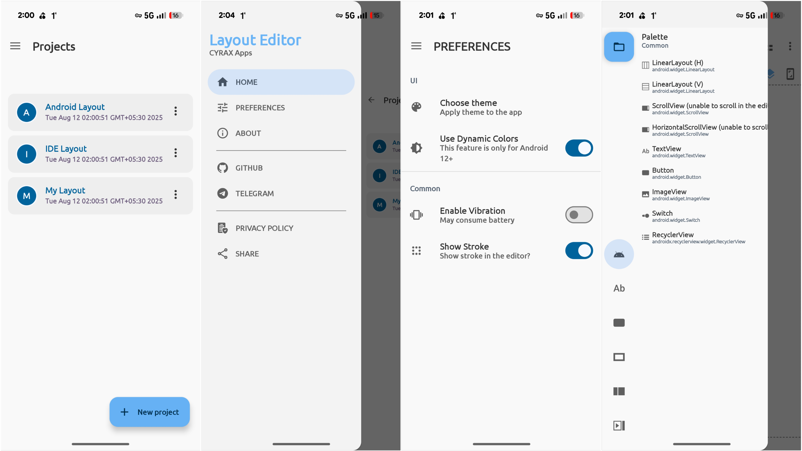

# Layout Editor

## Preview

## Pre-release
Layout Editor 0.9.0-alpha – Early release with core tools to design and edit layouts, built for speed and future features.

## Features
- [X] Drag and drop: The Layout Editor allows developers to easily drag and drop UI elements onto the design canvas, making it easy to create a visual representation of the app's layout.
- [X] WYSIWYG editing: The Layout Editor provides a What You See Is What You Get (WYSIWYG) interface, which allows developers to preview how their app will look on different devices.
- [X] Blueprint mode: In addition to the WYSIWYG mode, the Layout Editor also has a blueprint mode that allows developers to work with a wireframe view of the layout.
- [ ] Design tools: The Layout Editor provides a range of design tools, including alignment guides, snap-to-grid functionality, and a range of layout templates to make it easier to create professional-looking layouts.
- [ ] Theme editing: Developers can modify the theme of their app's layout by selecting from a range of pre-built themes or creating their own custom theme.
- [X] Component properties: The Layout Editor provides a range of component properties that developers can modify, including size, padding, margins, and more.
- [X] Preview mode: Developers can preview their app's layout on a range of devices, including smartphones, tablets, and wearables, to ensure that it looks good on all screen sizes.
- [ ] Code editing: The Layout Editor also allows developers to switch to code mode and manually edit the layout's XML code.
- [ ] Accessibility tools: The Layout Editor includes a range of accessibility tools to help developers ensure that their app's layout is accessible to all users, including those with disabilities.
- [ ] Layout validation: The Layout Editor includes a layout validation tool that can identify common layout issues and suggest ways to fix them.
